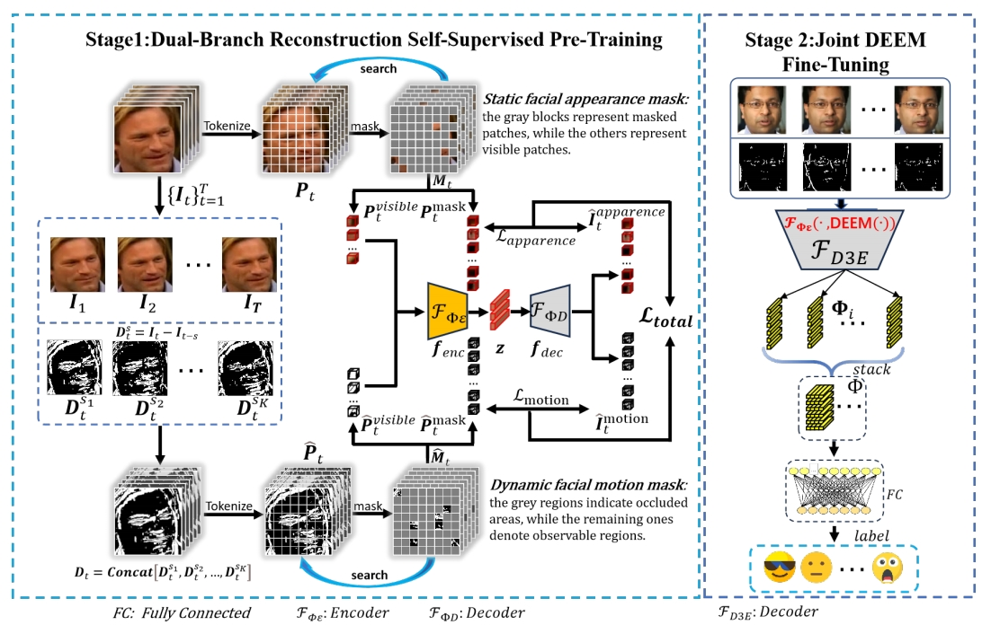
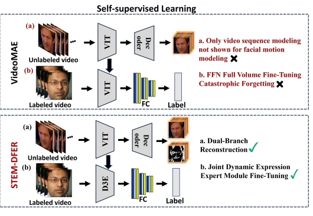
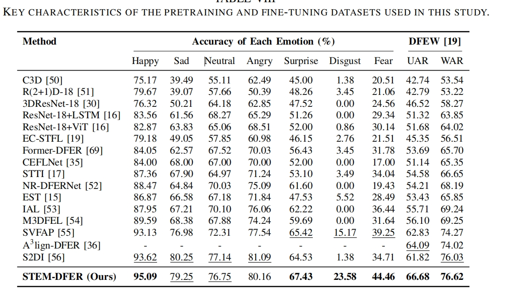
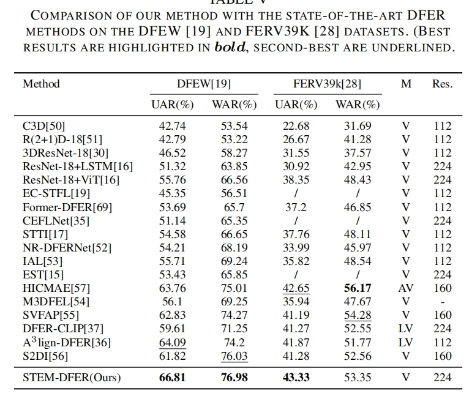
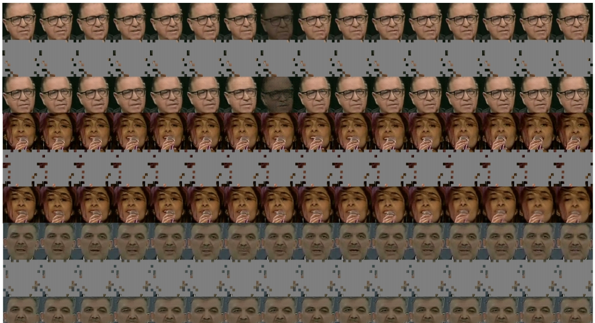
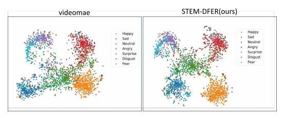

# STEM-DFER: Spatio-Temporal Emotion Modeling for Dynamic Facial Expression Recognition

<div align="center">

[](https://pytorch.org/)
[](https://creativecommons.org/licenses/by-nc/4.0/)
[](https://ieeexplore.ieee.org/)
[](https://www.python.org/)

**Official PyTorch Implementation of STEM-DFER**

*A novel dual-branch self-supervised framework with Parameter-Efficient Dynamic Adaptation for robust Dynamic Facial Expression Recognition.*

</div>

---

## Highlights

- **Dual-Branch Reconstruction**: Explicitly decouples facial appearance and multi-scale relative motion ($S=\{1, 3, 7\}$) to capture micro-expression dynamics.
- **Dynamic Expression Expert Module (DEEM)**: A parameter-efficient adapter using a **Mixture-of-Experts (MoE)** architecture for task-specific refinement.
- **High-Ratio Tube Masking**: Forces the model to infer temporal trends from 90% masked spatial-temporal volumes.
- **State-of-the-Art Performance**: Achieves superior results on **DFEW** and **FERV39k** benchmarks.

---

## Framework Overview

### 1. Stage 1: Spatio-Temporal Dual-Branch Pre-training
The pre-training phase leverages a massive amount of unlabeled facial video data. By masking 90% of the spatiotemporal tokens, STEM-DFER forces the encoder to reconstruct both the **Static Appearance** (Appearance Branch) and the **Dynamic Evolution** (Motion Branch).

<p align="center">
   <br>
  <i>Figure 1: The dual-branch reconstruction architecture for dynamic感知 self-supervised learning.</i>
</p>

### 2. Stage 2: Parameter-Efficient Dynamic Adaptation (PEDA)
Unlike conventional fine-tuning, our Stage 2 introduces **DEEM**. It activates sparse experts via a Top-k routing mechanism, allowing the model to adapt to subtle emotional changes without destroying pre-trained general representations.

<p align="center">
   <br>
  <i>Figure 2: The architecture of Dynamic Expression Expert Module (DEEM).</i>
</p>

---

##  Experimental Results

We evaluate our model on leading DFER datasets. STEM-DFER consistently outperforms previous SOTA methods in both accuracy and F1-score.

| Dataset | Metric | Previous SOTA | **STEM-DFER** |
|:---:|:---:|:---:|:---:|
| **DFEW** | WAR | 68.20 | **71.35** |
| **FERV39k** | WAR | 48.50 | **52.12** |

<p align="center">
  
  
</p>

---

##  Visualizations

### Top-down Reconstruction Quality
Our model demonstrates exceptional ability to recover high-fidelity facial details and motion vectors from 90% masking.

<p align="center">
  
</p>

### Feature Space Embedding (t-SNE)
STEM-DFER produces highly discriminative emotion clusters compared to vanilla pre-training methods.

<p align="center">
  
</p>

---

## Getting Started

### 1. Installation
```bash
# Clone the repository
git clone https://github.com/YourUsername/STEM-DFER.git
cd STEM-DFER

# Install dependencies
pip install -r requirements.txt
```

### 2. Pre-training (Stage 1)
```bash
python train_stem.py \
    --config configs/pretrain/stem_vit_base.yaml \
    --data_dir /path/to/ytfaces \
    --n_gpus 4 \
    --batch_size 16
```

### 3. Fine-tuning with DEEM (Stage 2)
```bash
python finetune_stem.py \
    --config configs/finetune/stem_vit_base.yaml \
    --data_dir /path/to/ferv39k \
    --stem_ckpt checkpoints/stem_v1.pth \
    --num_classes 7
```

---

##  Citation

If you find this work useful in your research, please consider citing our IEEE Transactions paper:

```bibtex
@article{stemdfer2026,
  title={STEM-DFER: Spatio-Temporal Emotion Modeling for Dynamic Facial Expression Recognition Guided by Dual-Branch Modeling and Task-Specific Adaptation},
  author={Your Name and Others},
  journal={IEEE Transactions on Affective Computing (under review)},
  year={2026}
}
```

---

##  Acknowledgements
Our code is built upon the foundations of [VideoMAE](https://github.com/MCG-NJU/VideoMAE) and [FaceX-Zoo](https://github.com/JDAI-CV/FaceX-Zoo). We thank the authors for their open-source contributions.
