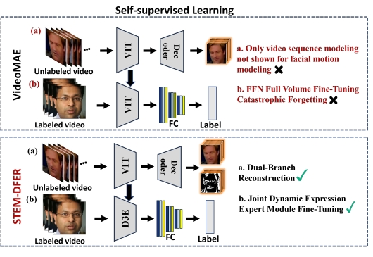
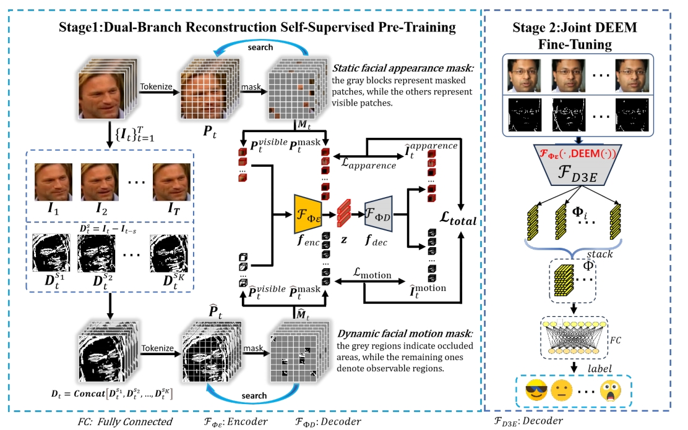
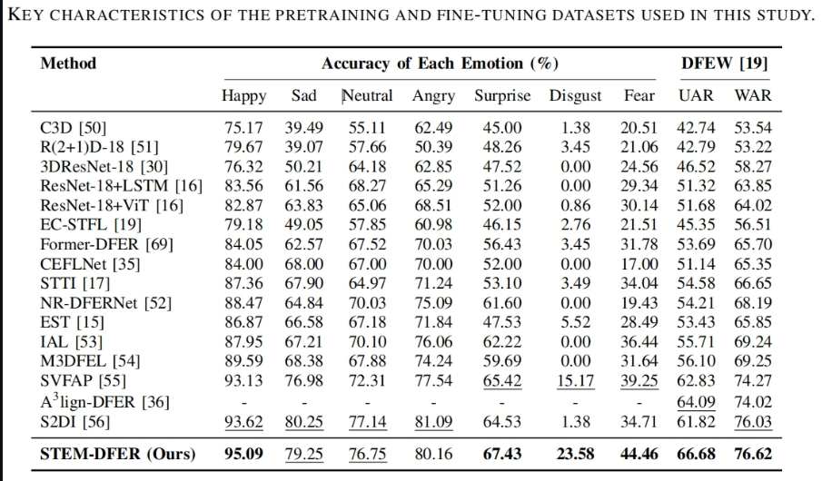
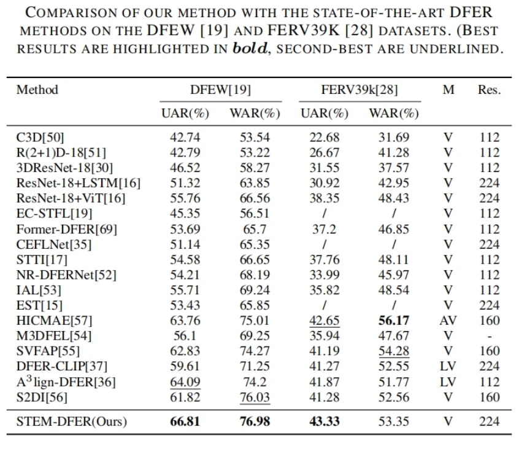
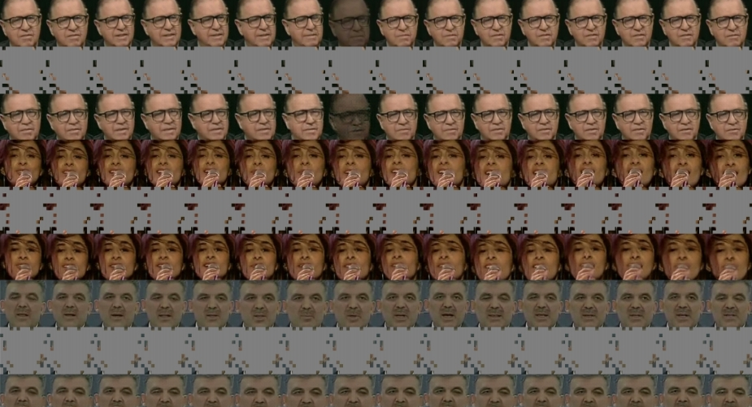
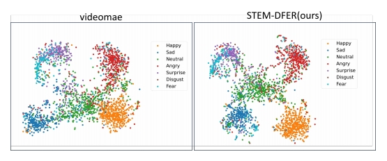
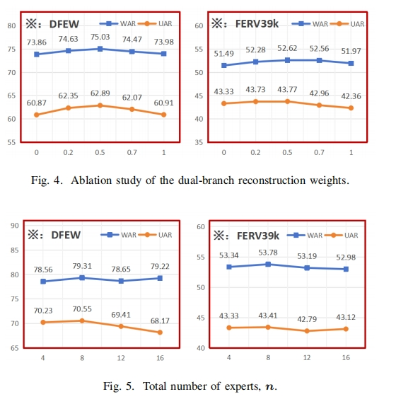

# STEM-DFER: Video Representation Learning for Facial Expression Recognition Guided by Dual-Branch Modeling and Task-Specific Adaptation

## ✨ Overview

Self-supervised learning, by leveraging the inherent structure of vast amounts of unlabeled data for feature self-learning, provides a new paradigm to address the data-dependency problem. Core techniques such as self-distillation, contrastive learning, and autoencoder have demonstrated significant potential in computer vision—for instance, the Masked Autoencoder (MAE), which pretrains visual encoders by reconstructing highly masked regions, has significantly improved downstream performance. Similarly, models such as BERT [38] and GPT in natural language processing have surpassed traditional supervised methods through self-supervision. However, as illustrated in Fig.~1, applying self-supervised learning to video-based emotion computing still faces two primary challenges: (1) most methods focus on static image features and overlook the temporal evolution of expressions—such as micro-expression duration and intensity changes—which are essential for capturing genuine affect dynamics; and (2) conventional full-parameter fine-tuning updates every model weight indiscriminately, incurring high computational and memory costs and causing catastrophic forgetting of pretrained representations, thus hindering effective adaptation to new tasks.

    
  Overview of our MAE-DFER.

To address these gaps, we propose a SpatioTemporal Emotion Modeling Framework, STEM-DFER, which aims to resolve the dependency on large-scale labeled data in supervised learning for DFER tasks through self-supervised learning. the STEM-DFER method consists of two key stages: pretraining and fine-tuning. The entire process is simple and is inspired by MAE and its video version . During the pretraining phase, a high proportion of spatial masking is applied to input facial video sequences to construct a parallel spatial-temporal dual-branch reconstruction task. The spatial branch uses the masked image as input and applies a lightweight decoder to restore local facial details (e.g., changes in crow's feet wrinkles, the trajectory of zygomaticus major muscle movements), compelling the encoder to capture spatially discriminative features of facial expressions. The temporal branch, supervised by multi-scale frame differences, reconstructs temporal motion features (e.g., derivatives of expression intensity over time), explicitly modeling the dynamic evolution of expressions. This design decouples spatiotemporal redundancy, enabling the encoder to learn hierarchical dynamic facial expression representations from unlabeled video, with lower levels capturing the spatial distribution of muscle movements and higher levels capturing the temporal patterns of expression intensity changes.

    
  Overview of our MAE-DFER.

## 🚀 Main Results

### ✨ DFEW &&   ✨ FERV39k

## 👀 Visualization

### ✨ Reconstruction 

### ✨ t-SNE on DFEW

### ✨ Ablation Studies

## 🔨 Installation

Main prerequisites:

* `Python 3.8`
* `PyTorch 1.7.1 (cuda 10.2)`
* `timm==0.4.12`
* `einops==0.6.1`
* `decord==0.6.0`
* `scikit-learn=1.1.3`
* `scipy=1.10.1`
* `pandas==1.5.3`
* `numpy=1.23.4`
* `opencv-python=4.7.0.72`
* `tensorboardX=2.6.1`

If some are missing, please refer to [environment.yml](environment.yml) for more details.
